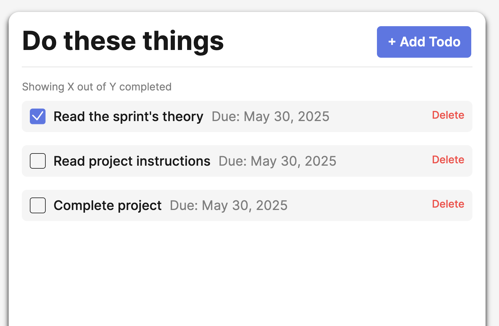

# Simple Todo App

A simple and intuitive Todo application built with vanilla JavaScript using Object-Oriented Programming (OOP) principles. Users can add, complete, and delete tasks through a clean user interface.

## Functionality

- Render a list of predefined todos on page load.
- Add new todos through a popup form.
- Mark todos as completed using checkboxes.
- Delete todos using a dedicated delete button.
- Form includes input validation with real-time feedback.
- Reset form inputs and disable submit button after successful submission.
- Utilizes `uuid` to generate unique IDs for new todos.

## Technology

- HTML5
- CSS3
- JavaScript
  - Modules
  - Classes & OOP
  - DOM Manipulation
- Live Server for local development
- Git & GitHub for version control and deployment

### Features

## Deployment

This project is deployed on GitHub Pages:

- [🔗 Click here to view the live site](https://github.com/rfrederic/se_project_todo-app)
